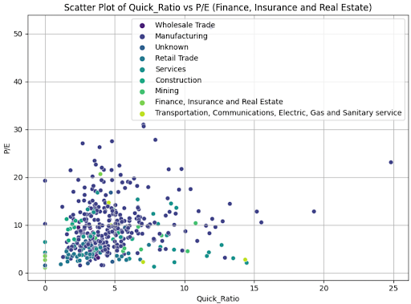

# How to Beat The Market!

### Research Direction: Analyzing the Financial Health of Middle Market Firms

By Noah Levine, Patrick Williams, Yuan Wang, Cillian Fisher

This is a website to showcase our final project for FIN 377 - Data Science for Finance course at Lehigh University.

## Table of contents
1. [Introduction](#introduction)
2. [Codes](#meth)
3. [Analysis Section](#section3)
4. [Summary](#summary)

## Introduction  <a name="introduction"></a>

The main purpose of this project is to explore the effectiveness and reliability of various financial metrics and valuation multiples in assessing the financial health and performance of middle market companies in the context of mergers and acquisitions (M&A). Specifically, our research aims to identify which financial metrics demonstrate the strongest correlation with commonly used valuation multiples across different economic sectors in the middle market. This will provide clearer investment strategies and enhance financial assessment methodologies, thereby facilitating more informed decision-making in the M&A process.

## Codes <a name="meth"></a>

Here is some code that we used to develop our analysis. 

We began by importing neccessary packages and defining our dataframe: 

```python
import numpy as np
import pandas as pd
df = pd.read_stata('ccm.dta')
#df.head()  
pd.set_option('display.max_columns', None)
#print(df.columns)
```

We then filtered our Market Caps and took out companies with no gross profit, calculating Market Capitlization:

```python
# Filter Market Caps and companies that dont have gross profit
MiddleMarket_data = df[(df['mkvalt'] >= 0) & (df['mkvalt'] <= 12000)]
# Calculate market capitalization
MiddleMarket_data['Avg_Price'] = (MiddleMarket_data['prch_c'] + MiddleMarket_data['prcl_c']) / 2
MiddleMarket_data['Market_Cap'] = MiddleMarket_data['Avg_Price'] * MiddleMarket_data['csho']
```

More filtering to find where EBITDA was positive and then selected relevant columns for analysis.
We also re-ordered the columns for readibility:

```python
filtered_data = MiddleMarket_data.loc[MiddleMarket_data['ebitda'] > 0, ['tic','ebitda','dvc','ob','conm','fdate','lt','fyr','xrd','cogs','oibdp','capx','at','revt', 'xsga','ppent','csho','ppegt', 'che','ceq','lct','prcl_c','prch_c','Avg_Price','Market_Cap','oiadp','invt','sich','emp','txt','xint','act']]
#filtered_data
filtered_data.columns = ['Ticker', 'EBITDA', 'Dividends', 'Operating Income', 'Company Name', 'Fiscal Date', 'Long-Term Debt', 'Fiscal Year', 'Research and Development Expenses', 'Cost of Goods Sold', 'Operating Income Before Depreciation', 'Capital Expenditures', 'Total Assets', 'Revenue', 'Selling, General, and Administrative Expenses', 'Property, Plant, and Equipment Net', 'Common Shares Outstanding', 'Gross Property, Plant, and Equipment', 'Cash and Equivalents', 'Common Equity', 'Current Liabilities', '52-Week Low Price', '52-Week High Price','Avg_Price','Market_Cap','OpInc After Dep','Inventory','SP Index Code','Employees','Taxes','Interest Expense','Current Assets']
filtered_data.reindex()
filtered_data = filtered_data[['Ticker', 'Company Name', 'Market_Cap','Fiscal Date', 'Fiscal Year','Employees','SP Index Code', 'EBITDA', 'Operating Income', 'Dividends', 'Long-Term Debt', 'Research and Development Expenses', 'Cost of Goods Sold', 'Operating Income Before Depreciation', 'Capital Expenditures', 'Total Assets', 'Revenue', 'Selling, General, and Administrative Expenses', 'Property, Plant, and Equipment Net', 'Common Shares Outstanding', 'Gross Property, Plant, and Equipment', 'Cash and Equivalents', 'Common Equity', 'Current Liabilities', '52-Week Low Price', '52-Week High Price','Avg_Price','Market_Cap','OpInc After Dep','Inventory','SP Index Code','Employees','Taxes','Interest Expense','Current Assets']]
```

Then we added new columns into the reordered dataframe:

```python
# EV/EBITDA
filtered_data['Enterprise_Value'] = filtered_data['Market_Cap'] + filtered_data['Long-Term Debt'] - filtered_data['Cash and Equivalents']
filtered_data['EV/EBITDA'] = filtered_data['Enterprise_Value'] / filtered_data['EBITDA']
# P/E Ratio
filtered_data['EPS'] = filtered_data['Operating Income Before Depreciation'] / filtered_data['Common Shares Outstanding']
filtered_data['P/E'] = filtered_data['Avg_Price'] / filtered_data['EPS']
# Debt-to-Equity Ratio
filtered_data['Debt_to_Equity'] = filtered_data['Long-Term Debt'] / filtered_data['Common Equity']
# Return on Equity (ROE)
filtered_data['ROE'] = filtered_data['Operating Income Before Depreciation'] / filtered_data['Common Equity']
# Current Ratio
filtered_data['Current_Ratio'] = filtered_data['Total Assets'] / filtered_data['Current Liabilities']
# Quick Ratio
filtered_data['Quick_Ratio'] = (filtered_data['Total Assets'] - filtered_data['Inventory']) / filtered_data['Current Liabilities']
# Interest Covered Ratio
filtered_data['Interest_Coverage_Ratio'] = filtered_data['EBITDA'] / filtered_data['Interest Expense']
# Gross Margin
filtered_data['Gross_Margin'] = (filtered_data['Revenue'] - filtered_data['Cost of Goods Sold']) / filtered_data['Revenue']
# Operating Margin
filtered_data['Operating_Margin'] = filtered_data['Operating Income Before Depreciation'] / filtered_data['Revenue']
# Calculate Gross Profit
filtered_data['Gross Profit'] = filtered_data['Revenue'] - filtered_data['Cost of Goods Sold']
# Calculate Gross Profit Margin
filtered_data['Gross Profit Margin'] = (filtered_data['Gross Profit'] / filtered_data['Revenue']) 
#EV/GP 
filtered_data['EV/GP'] = filtered_data['Enterprise_Value'] / filtered_data['Gross Profit']
# Calculate EBITDA - Capex
filtered_data['EBITDA - Capex'] = filtered_data['EBITDA'] - filtered_data['Capital Expenditures']
# Calculate EBITDA - Capex margin
filtered_data['EBITDA - Capex Margin'] = (filtered_data['EBITDA - Capex'] / filtered_data['EBITDA']) 
filtered_data['EV/EBITDA-Capex'] = filtered_data['Enterprise_Value'] / filtered_data['EBITDA - Capex']
filtered_data['Free Cash Flow'] = (filtered_data['EBITDA']
                                   - filtered_data['Taxes']
                                   - filtered_data['Interest Expense']
                                   + (filtered_data['Current Assets'] - filtered_data['Current Liabilities'])
                                   - filtered_data['Capital Expenditures'])
filtered_data['FCF_Positive'] = (filtered_data['Free Cash Flow'] > 0).astype(int)
filtered_data['FCF Yield'] = filtered_data['Free Cash Flow'] / filtered_data['Market_Cap']
filtered_data['Invested_Capital'] = filtered_data['Long-Term Debt'] + filtered_data['Common Equity']
filtered_data['EBIT'] = filtered_data['Operating Income'] + filtered_data['Interest Expense'] + filtered_data['Taxes']
filtered_data['EV_EBIT'] = filtered_data['Enterprise_Value'] / filtered_data['EBIT']
filtered_data['ROIC'] = filtered_data['EBIT'] / filtered_data['Invested_Capital']
filtered_data['EBIT Margin (%)'] = (filtered_data['EBIT'] / filtered_data['Revenue']) 
filtered_data['EBIT_Positive'] = (filtered_data['EBIT'] > 0).astype(int)
filtered_data

filtered_data['Revenue per Employee'] = filtered_data['Revenue'] / filtered_data['Employees']

filtered_data['Total Debt Service'] = filtered_data['Long-Term Debt'] + filtered_data['Interest Expense']
filtered_data['Debt_Coverage_Ratio'] = filtered_data['Operating Income Before Depreciation'] / filtered_data['Total Debt Service']

filtered_data['Dividend (y/n)'] = (filtered_data['Dividends'] > 0).astype(int)

filtered_data['Price_Range_Ratio'] = (filtered_data['52-Week High Price'] - filtered_data['52-Week Low Price']) / filtered_data['52-Week Low Price']

filtered_data.describe()
```

Then we came to the crucial step. Initially, we created two variables: multiples and metrics. After grouping by divisions and drop all the non numerical data, we calculated correlation matrices between the 'multiples' and 'metrics' for each divisions:

```python
# Define the multiples and metrics
multiples = ['EV/EBITDA', 'EV/Sales', 'P/E', 'EV/GP','EV_EBIT','FCF Yield','EV/EBITDA-Capex']
metrics = ['Debt_Coverage_Ratio', 'ROE', 'EBIT Margin (%)',
           'YOY_Gross_Profit_Change','ROIC','FCF_Positive',
           'Gross_Margin','Quick_Ratio','Current_Ratio','Debt_to_Equity',
           'Revenue per Employee','FCF_Positive','YOY_Revenue_Change','YOY_EBIT_Change']

# Drop the specified non-numeric columns
columns_to_drop = ['Ticker', 'Division']

# Iterate over each unique Division in the dataset
grouped_data = selected_df.groupby('Division')
for division, group in grouped_data:
    # Drop the non-numeric columns
    group = group.drop(columns=columns_to_drop, errors='ignore')
    
    # Keep only the columns that are multiples or metrics
    subset = group[multiples + metrics].select_dtypes(include='number')
    
    # Calculate the correlation matrix
    corr = subset.corr()
    
    # Plot the correlation matrix using seaborn heatmap
    plt.figure(figsize=(10, 8))
    sns.heatmap(corr, cmap='coolwarm', annot=True)
    plt.title(f'Correlation Matrix for Division: {division}')
    plt.show()
```
Then, print out top 5 correlations for better visualizations:

```python
import seaborn as sns
import matplotlib.pyplot as plt
from scipy.stats import linregress

# Define the multiples and metrics
multiples = ['EV/EBITDA','EV/Sales']  #multiples = ['EV/EBITDA', 'P/E', 'EV/GP','EV_EBIT','FCF Yield','EV/EBITDA-Capex']
metrics = ['Debt_Coverage_Ratio', 'ROE', 'EBIT Margin (%)',
           'YOY_Gross_Profit_Change','ROIC','FCF_Positive',
           'Gross_Margin','Quick_Ratio','Current_Ratio','Debt_to_Equity',
           'Revenue per Employee','FCF_Positive','YOY_Revenue_Change','YOY_EBIT_Change']

# Group data by sector
grouped_data = selected_df.groupby('Division')

# Calculate correlation between multiples and metrics for each sector
correlation_results = {}
for sector, group in grouped_data:
    correlation_results[sector] = {}
    for multiple in multiples:
        for metric in metrics:
            correlation = group[multiple].corr(group[metric])
            correlation_results[sector][(multiple, metric)] = correlation

# Sort correlation results and select top 5 correlations
top_correlations = {}
for sector, result in correlation_results.items():
    top_correlations[sector] = sorted(result.items(), key=lambda x: abs(x[1]), reverse=True)[:5]

# Plot scatter plots for top 5 correlations
for sector, correlations in top_correlations.items():
    print(f"--- {sector} ---")
    for (multiple, metric), correlation in correlations:
        plt.figure(figsize=(8, 6))
        sns.scatterplot(data=selected_df, x=metric, y=multiple, hue='Division', palette='viridis')
        plt.title(f'Scatter Plot of {metric} vs {multiple} ({sector})')
        plt.xlabel(metric)
        plt.ylabel(multiple)
        plt.legend()
        plt.grid(True)
        plt.tight_layout()
        plt.show()
```

Follow-up, we did multiple linear regression for each multiple as a dependent variable, using metrics as independent variables, grouped by division. It outputs a detailed summary for each regression, Gaining our understanding on impact of various metrics on the multiples:

```python
import statsmodels.api as sm

# Assuming 'selected_df' is the DataFrame containing the data

# Define the multiples (dependent variables) and metrics (independent variables)
multiples = ['EV/EBITDA','EV/Sales']  #multiples = ['EV/EBITDA', 'P/E', 'EV/GP','EV_EBIT','FCF Yield','EV/EBITDA-Capex']
metrics = ['Debt_Coverage_Ratio', 'ROE', 'EBIT Margin (%)',
           'YOY_Gross_Profit_Change','ROIC','FCF_Positive',
           'Gross_Margin','Quick_Ratio','Current_Ratio','Debt_to_Equity',
           'Revenue per Employee','FCF_Positive','YOY_Revenue_Change','YOY_EBIT_Change']

# Group data by Division
grouped_data = selected_df.groupby('Division')

# Perform MLR for each multiple by each industry
for division, group in grouped_data:
    print(f'\nDivision: {division}')
    
    # Drop non-numeric columns and keep only columns with multiples and metrics
    group = group[multiples + metrics].select_dtypes(include='number')
    
    for multiple in multiples:
        # Prepare the dependent (y) and independent (X) variables
        if multiple in group.columns:
            y = group[multiple].dropna()  # Drop missing values
            X = group.loc[y.index, metrics].dropna()
            
            # Add a constant to the model (intercept term)
            X = sm.add_constant(X)
            
            # Fit the model
            model = sm.OLS(y, X).fit()
            
            # Print the summary of the model
            print(f'\nMultiple: {multiple}')
            print(model.summary())
```

Then we did some Machine Learning using ExplainableBoostingRegressor:

```python
from sklearn.model_selection import train_test_split
from interpret.glassbox import ExplainableBoostingRegressor 
from interpret import show

X = selected_df.drop(columns=['Ticker', 'Division'])
y = selected_df['EV/EBITDA']

# Split the dataset into training and testing sets
seed = 42
np.random.seed(seed)
X_train, X_test, y_train, y_test = train_test_split(X, y, test_size=0.20, random_state=seed)

# Initialize the ExplainableBoostingRegressor
ebm = ExplainableBoostingRegressor(random_state=seed)

# Fit the model
ebm.fit(X_train, y_train)

# Get the global feature importances from the model
ebm_global = ebm.explain_global()
show(ebm_global)
```

Then we created code to choose the best features using RandomForestRegressor:

```python
from sklearn.ensemble import RandomForestRegressor
from sklearn.preprocessing import StandardScaler
import seaborn as sns
import matplotlib.pyplot as plt

# Group the data by 'Division'
for division, group in selected_df.groupby('Division'):
    print(f"\nDivision: {division}")

    # Prepare the features (X) and target (y)
    X = group.drop(columns=['Ticker', 'Division', 'EV/EBITDA', 'P/E', 'EV/GP', 'EV_EBIT', 'FCF Yield', 'EV/EBITDA-Capex'])
    y = group['EV/EBITDA']

    # Check if there are enough samples to train the model
    if len(y) < 2:
        print(f"Not enough samples to perform feature selection for {division}")
        continue

    # Scale the features
    scaler = StandardScaler()
    X_scaled = scaler.fit_transform(X)

    # Use RandomForestRegressor to get feature importances
    rf = RandomForestRegressor(random_state=42)
    rf.fit(X_scaled, y)
    feature_importances = rf.feature_importances_
```

We did the samething repetitively, but this time we defined y as EV/SALES:

```python
# Loop through each unique Division and compute feature importance
for division, group in selected_df.groupby('Division'):
    print(f"\nDivision: {division}")
    
    # Prepare features (X) and target (y)
    X = group.drop(columns=['Ticker', 'Division','EV/EBITDA', 'P/E', 'EV/GP','EV_EBIT','EV/Sales', 'FCF Yield','EV/EBITDA-Capex'])
    y = group['EV/Sales']

    # Check if there are enough samples to perform a split and modeling
    if len(y) < 10:
        print(f"Not enough samples to perform feature selection for {division}")
        continue
    
    # Split the dataset into training and testing sets
    X_train, X_test, y_train, y_test = train_test_split(X, y, test_size=0.20, random_state=42)

    # Initialize the ExplainableBoostingRegressor
    ebm = ExplainableBoostingRegressor(random_state=42)

    # Fit the model
    ebm.fit(X_train, y_train)

    # Get the global feature importances from the model
    ebm_global = ebm.explain_global()
    show(ebm_global)
```

```python
# Group the data by 'Division'
for division, group in selected_df.groupby('Division'):
    print(f"\nDivision: {division}")

    # Prepare the features (X) and target (y)
    X = group.drop(columns=['Ticker', 'Division', 'EV/EBITDA', 'P/E', 'EV/GP', 'EV_EBIT','EV/Sales', 'FCF Yield', 'EV/EBITDA-Capex'])
    y = group['EV/Sales']

    # Check if there are enough samples to train the model
    if len(y) < 10:
        print(f"Not enough samples to perform feature selection for {division}")
        continue

    # Scale the features
    scaler = StandardScaler()
    X_scaled = scaler.fit_transform(X)

    # Use RandomForestRegressor to get feature importances
    rf = RandomForestRegressor(random_state=42)
    rf.fit(X_scaled, y)
    feature_importances = rf.feature_importances_

    # Plot feature importances
    features = pd.DataFrame({'Feature': X.columns, 'Importance': feature_importances})
    features = features.sort_values(by='Importance', ascending=False)
    
    plt.figure(figsize=(10, 6))
    sns.barplot(x='Importance', y='Feature', data=features.head(20))
    plt.title(f'Top 20 Important Features according to Random Forest for {division}')
    plt.show()
```
If you want to go through our codes coherently, please click the link [here](projectpdf.pdf).

## Analysis Section <a name="section3"></a>

Here are some graphs that we created in our analysis. We saved them to the `pics/` subfolder and include them via the usual markdown syntax for pictures.


<br><br>
Some analysis here
<br><br>

<br><br>
More analysis here.
<br><br>

<br><br>
<br><br>

<br><br>
<br><br>

<br><br>
<br><br>

<br><br>
<br><br>

<br><br>
More analysis.

## Summary <a name="summary"></a>

Blah blah


## About the team


<br>
Noah is a post grad student, Mastering in Financial Engineering.
<br><br><br>

<br>
Pat is a post grad student, Mastering in Business Analytics.
<br><br><br>

<br>
Yuan is a senior studying Finance.
<br><br><br>

<br>
Cillian is a senior also studying Finance.
